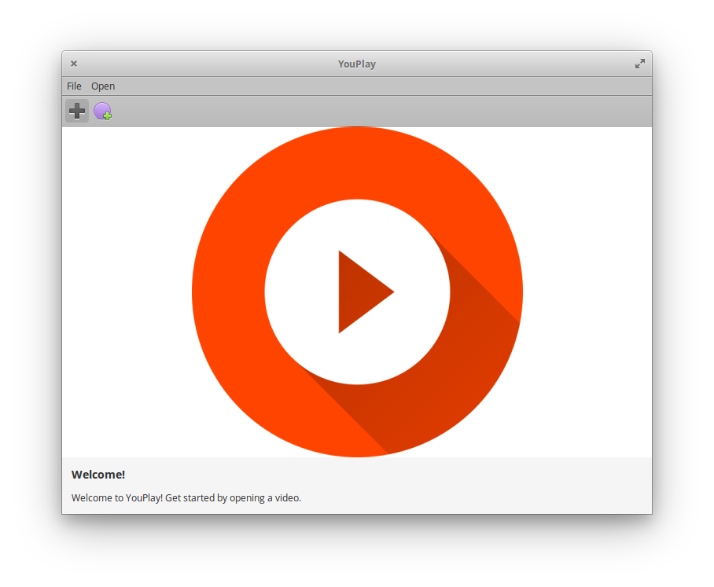

# youplay
A minimalistic youtube player - for linux  



## Installation
```bash
git clone https://github.com/allen-b1/youplay.git/
cd youplay
make USERNAME=your_username
```

An item for YouPlay should appear in the application menu. If not, restart the computer. If that still doesn't work, open an issue and post the details there.

## Features
With YouPlay, you can:
* Watch videos
* Watch playlists
